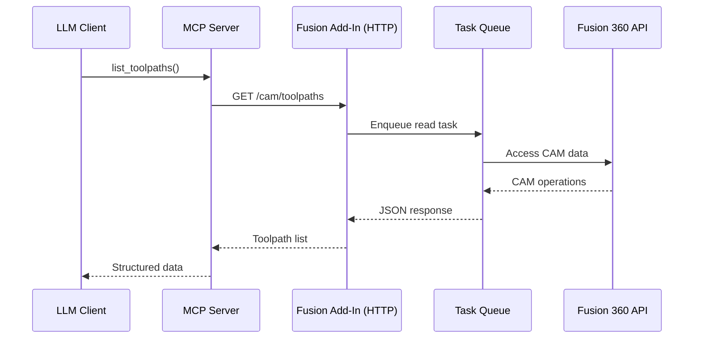

# Design Document: CAM Parameter Access

## Overview

This feature adds programmatic CAM (Computer-Aided Manufacturing) parameter access to the Fusion 360 MCP add-in. It enables LLM assistants to:

1. List all toolpath operations across setups in a document
2. Inspect detailed parameters of specific toolpath operations
3. Modify toolpath parameters when requested by the user
4. Query tool library information

The implementation follows the existing architecture pattern: HTTP endpoints in the Fusion Add-In communicate with MCP tools in the server, using a task queue for thread-safe Fusion API access.

## Architecture



The CAM API access is read-heavy and can be performed synchronously for queries, but parameter modifications must go through the task queue to ensure thread safety.

## Components and Interfaces

### 1. Fusion Add-In CAM Module (`MCP/cam.py`)

New module containing CAM-specific functions:

```python
# Core functions
def get_cam_product() -> adsk.cam.CAM | None
def list_all_toolpaths(cam: adsk.cam.CAM) -> list[dict]
def get_toolpath_parameters(cam: adsk.cam.CAM, toolpath_id: str) -> dict
def set_toolpath_parameter(cam: adsk.cam.CAM, toolpath_id: str, param_name: str, value: Any) -> dict
def get_tool_info(cam: adsk.cam.CAM, tool_id: str) -> dict
```

### 2. HTTP Endpoints (in `MCP/MCP.py`)

New endpoints added to the HTTP handler:

| Endpoint | Method | Description |
|----------|--------|-------------|
| `/cam/toolpaths` | GET | List all toolpaths in document |
| `/cam/toolpath/<id>` | GET | Get parameters for specific toolpath |
| `/cam/toolpath/<id>/parameter` | POST | Modify a toolpath parameter |
| `/cam/tools` | GET | List all tools used in document |
| `/cam/tool/<id>` | GET | Get specific tool information |

### 3. MCP Server Tools (in `Server/MCP_Server.py`)

New MCP tools:

```python
@mcp.tool()
def list_cam_toolpaths() -> dict
    """Lists all toolpath operations in the current Fusion 360 document."""

@mcp.tool()
def get_toolpath_details(toolpath_id: str) -> dict
    """Gets detailed parameters for a specific toolpath operation, including tool settings."""

@mcp.tool()
def modify_toolpath_parameter(toolpath_id: str, parameter_name: str, value: str) -> dict
    """Modifies a parameter value for a specific toolpath."""

@mcp.tool()
def get_tool_info(tool_id: str) -> dict
    """Gets information about a specific cutting tool."""
```

### 4. Configuration Updates (`Server/config.py`)

New endpoints added to the ENDPOINTS dictionary:

```python
ENDPOINTS = {
    # ... existing endpoints ...
    "cam_toolpaths": f"{BASE_URL}/cam/toolpaths",
    "cam_toolpath": f"{BASE_URL}/cam/toolpath",
    "cam_toolpath_parameter": f"{BASE_URL}/cam/toolpath/parameter",
    "cam_tools": f"{BASE_URL}/cam/tools",
    "cam_tool": f"{BASE_URL}/cam/tool",
}
```

## Data Models

### Toolpath List Response

```json
{
  "setups": [
    {
      "id": "setup_001",
      "name": "Setup1",
      "toolpaths": [
        {
          "id": "op_001",
          "name": "Adaptive1",
          "type": "adaptive",
          "tool_name": "6mm Flat Endmill",
          "tool_id": "tool_001",
          "is_valid": true
        }
      ]
    }
  ],
  "total_count": 5,
  "message": null
}
```

### Toolpath Parameters Response

```json
{
  "id": "op_001",
  "name": "Adaptive1",
  "type": "adaptive",
  "setup_name": "Setup1",
  "tool": {
    "id": "tool_001",
    "name": "6mm Flat Endmill",
    "diameter": 6.0,
    "diameter_unit": "mm"
  },
  "tool_settings": {
    "preset_spindle_speed": {
      "value": 10000,
      "unit": "rpm",
      "type": "numeric"
    },
    "surface_speed": {
      "value": 200,
      "unit": "m/min",
      "type": "numeric"
    },
    "feed_per_tooth": {
      "value": 0.05,
      "unit": "mm",
      "type": "numeric"
    },
    "ramp_spindle_speed": {
      "value": 8000,
      "unit": "rpm",
      "type": "numeric"
    },
    "plunge_spindle_speed": {
      "value": 5000,
      "unit": "rpm",
      "type": "numeric"
    },
    "feed_per_revolution": {
      "value": 0.2,
      "unit": "mm/rev",
      "type": "numeric"
    }
  },
  "parameters": {
    "feeds_and_speeds": {
      "spindle_speed": {
        "value": 10000,
        "unit": "rpm",
        "type": "numeric",
        "min": 0,
        "max": 50000,
        "editable": true
      },
      "cutting_feedrate": {
        "value": 1000,
        "unit": "mm/min",
        "type": "numeric",
        "min": 0,
        "editable": true
      },
      "plunge_feedrate": {
        "value": 300,
        "unit": "mm/min",
        "type": "numeric",
        "editable": true
      }
    },
    "geometry": {
      "stepover": {
        "value": 40,
        "unit": "%",
        "type": "numeric",
        "min": 1,
        "max": 100,
        "editable": true
      },
      "stepdown": {
        "value": 2.0,
        "unit": "mm",
        "type": "numeric",
        "editable": true
      },
      "tolerance": {
        "value": 0.01,
        "unit": "mm",
        "type": "numeric",
        "editable": true
      }
    },
    "heights": {
      "clearance_height": {
        "value": 15.0,
        "unit": "mm",
        "type": "numeric",
        "editable": true
      },
      "retract_height": {
        "value": 5.0,
        "unit": "mm",
        "type": "numeric",
        "editable": true
      }
    }
  }
}
```

### Tool Information Response

```json
{
  "id": "tool_001",
  "name": "6mm Flat Endmill",
  "type": "flat end mill",
  "geometry": {
    "diameter": 6.0,
    "diameter_unit": "mm",
    "overall_length": 50.0,
    "flute_length": 20.0,
    "shaft_diameter": 6.0,
    "corner_radius": 0.0
  },
  "specifications": {
    "flute_count": 4,
    "material": "carbide",
    "coating": "TiAlN"
  },
  "tool_number": 1
}
```

### Error Response

```json
{
  "error": true,
  "message": "Toolpath with ID 'op_999' not found",
  "code": "TOOLPATH_NOT_FOUND"
}
```

## Correctness Properties

*A property is a characteristic or behavior that should hold true across all valid executions of a system-essentially, a formal statement about what the system should do. Properties serve as the bridge between human-readable specifications and machine-verifiable correctness guarantees.*

Based on the prework analysis, the following properties can be combined and consolidated:

### Property 1: Toolpath list completeness
*For any* CAM document with toolpaths, the list endpoint response SHALL contain all toolpaths organized by their parent setup, with each toolpath including name, operation type, tool name, and unique identifier.
**Validates: Requirements 1.1, 1.2, 1.4**

### Property 2: Toolpath parameter completeness
*For any* valid toolpath query, the response SHALL include feeds/speeds parameters (spindle speed, feed rate, plunge rate), geometry parameters (stepover, stepdown, tolerances), tool definition (tool number, diameter, flute count), and tool settings (preset spindle speed, surface speed, feed per tooth).
**Validates: Requirements 2.1, 2.2, 2.3, 2.4, 2.7**

### Property 3: JSON serialization round-trip
*For any* toolpath parameter response, serializing to JSON and parsing back SHALL produce equivalent data structures with all parameter types correctly preserved.
**Validates: Requirements 2.6**

### Property 4: Parameter metadata completeness
*For any* parameter in a toolpath response, the response SHALL include the parameter type, and for parameters with constraints/units/enum options, those metadata fields SHALL be present.
**Validates: Requirements 3.1, 3.2, 3.3, 3.4**

### Property 5: Valid parameter modification
*For any* valid parameter modification request (correct type, within range, editable parameter), the system SHALL update the parameter and subsequent queries SHALL reflect the new value.
**Validates: Requirements 4.1**

### Property 6: Invalid parameter rejection
*For any* invalid parameter modification request (wrong type, out of range), the system SHALL reject the update and return an error message describing the validation failure.
**Validates: Requirements 4.2**

### Property 7: Tool information completeness
*For any* tool query, the response SHALL include tool geometry (diameter, length, flute length) and specifications (flute count, material), and toolpath responses SHALL include the tool identifier.
**Validates: Requirements 6.1, 6.2, 6.3, 6.4**

## Error Handling

| Error Condition | HTTP Status | Error Code | Message |
|-----------------|-------------|------------|---------|
| No CAM data in document | 200 | N/A | Empty list with message |
| Toolpath not found | 404 | TOOLPATH_NOT_FOUND | "Toolpath with ID '{id}' not found" |
| Tool not found | 404 | TOOL_NOT_FOUND | "Tool with ID '{id}' not found" |
| Invalid parameter value | 400 | INVALID_VALUE | "Value '{value}' is invalid for parameter '{name}': {reason}" |
| Read-only parameter | 400 | READ_ONLY | "Parameter '{name}' is read-only and cannot be modified" |
| Fusion not connected | 503 | CONNECTION_ERROR | "Cannot connect to Fusion 360. Ensure the add-in is running." |
| CAM workspace not active | 400 | WRONG_WORKSPACE | "CAM operations require the Manufacturing workspace" |

## Testing Strategy

### Dual Testing Approach

This feature requires both unit tests and property-based tests:

- **Unit tests**: Verify specific examples, edge cases, and error conditions
- **Property-based tests**: Verify universal properties hold across all valid inputs

### Property-Based Testing Framework

The implementation will use **Hypothesis** for Python property-based testing.

Each property-based test must:
1. Run a minimum of 100 iterations
2. Be tagged with a comment referencing the correctness property: `**Feature: dialog-reader, Property {number}: {property_text}**`
3. Use smart generators that constrain to valid input spaces

### Test Categories

1. **CAM Module Unit Tests** (`MCP/tests/test_cam.py`)
   - Test `list_all_toolpaths` with mock CAM data
   - Test `get_toolpath_parameters` with various operation types
   - Test `set_toolpath_parameter` validation logic
   - Test error handling for missing toolpaths/tools

2. **HTTP Endpoint Tests** (`MCP/tests/test_cam_endpoints.py`)
   - Test endpoint routing and response formats
   - Test error responses for invalid requests
   - Test JSON serialization of CAM data

3. **MCP Tool Tests** (`Server/tests/test_cam_tools.py`)
   - Test MCP tool registration
   - Test tool parameter validation
   - Test HTTP communication with mock server

4. **Property-Based Tests** (`MCP/tests/test_cam_properties.py`)
   - Property 1: Toolpath list completeness
   - Property 2: Toolpath parameter completeness
   - Property 3: JSON round-trip
   - Property 4: Parameter metadata completeness
   - Property 5: Valid modification success
   - Property 6: Invalid modification rejection
   - Property 7: Tool information completeness

### Test Data Generation

For property-based tests, generators will create:
- Random toolpath configurations with valid parameter ranges
- Random tool definitions with realistic geometry
- Random parameter modification requests (both valid and invalid)
