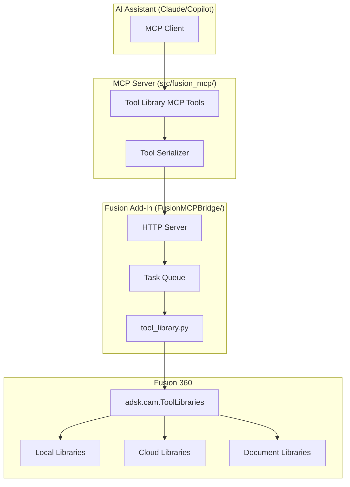

# Tool Library Feature Design

## Overview

This feature extends the Fusion MCP Integration to provide comprehensive access to Fusion 360's Tool Library system. It enables AI assistants to:

1. Browse and list tool libraries (local, cloud, document)
2. Query detailed tool information including geometry and cutting data
3. Create new tools with custom specifications
4. Modify existing tool properties
5. Duplicate and delete tools
6. Search for tools by criteria

The implementation follows the existing architecture pattern: HTTP endpoints in the Fusion Add-In communicate with MCP tools in the server, using a task queue for thread-safe Fusion API access.

## Architecture



## Components and Interfaces

### MCP Server Tools (src/fusion_mcp/server.py)

New MCP tools to be added:

| Tool Name | Description | HTTP Method | Endpoint |
|-----------|-------------|-------------|----------|
| `list_tool_libraries` | List all accessible tool libraries | GET | `/tool-libraries` |
| `list_library_tools` | List tools in a specific library | GET | `/tool-libraries/{library_id}/tools` |
| `get_tool_details` | Get detailed tool information | GET | `/tools/{tool_id}` |
| `create_tool` | Create a new tool in a library | POST | `/tool-libraries/{library_id}/tools` |
| `modify_tool` | Update tool properties | PUT | `/tools/{tool_id}` |
| `duplicate_tool` | Copy a tool to a library | POST | `/tools/{tool_id}/duplicate` |
| `delete_tool` | Remove a tool from library | DELETE | `/tools/{tool_id}` |
| `search_tools` | Search tools by criteria | POST | `/tools/search` |

### Fusion Add-In Module (FusionMCPBridge/tool_library.py)

New module containing functions for tool library operations:

```python
# Core functions
def list_libraries() -> dict
def list_tools(library_id: str) -> dict
def get_tool(tool_id: str) -> dict
def create_tool(library_id: str, tool_data: dict) -> dict
def modify_tool(tool_id: str, updates: dict) -> dict
def duplicate_tool(tool_id: str, target_library_id: str, new_name: str) -> dict
def delete_tool(tool_id: str) -> dict
def search_tools(criteria: dict) -> dict

# Helper functions
def _find_library_by_id(library_id: str) -> Optional[ToolLibrary]
def _find_tool_by_id(tool_id: str) -> Optional[Tool]
def _serialize_library(library) -> dict
def _serialize_tool(tool) -> dict
def _deserialize_tool_data(data: dict) -> dict
def _is_library_writable(library) -> bool
def _is_tool_in_use(tool_id: str) -> bool
```

### Configuration (src/fusion_mcp/config.py)

New endpoints to add:

```python
ENDPOINTS = {
    # ... existing endpoints ...
    "tool_libraries": f"{BASE_URL}/tool-libraries",
    "tool_library_tools": f"{BASE_URL}/tool-libraries",  # /{library_id}/tools
    "tool_details": f"{BASE_URL}/tools",  # /{tool_id}
    "tool_create": f"{BASE_URL}/tool-libraries",  # /{library_id}/tools
    "tool_modify": f"{BASE_URL}/tools",  # /{tool_id}
    "tool_duplicate": f"{BASE_URL}/tools",  # /{tool_id}/duplicate
    "tool_delete": f"{BASE_URL}/tools",  # /{tool_id}
    "tool_search": f"{BASE_URL}/tools/search",
}
```

## Data Models

### Tool Library Response

```json
{
  "libraries": [
    {
      "id": "lib_local_001",
      "name": "My Local Tools",
      "type": "local",
      "tool_count": 25,
      "is_writable": true
    },
    {
      "id": "lib_cloud_001", 
      "name": "Fusion 360 Library",
      "type": "cloud",
      "tool_count": 150,
      "is_writable": false
    }
  ],
  "total_count": 2,
  "message": null
}
```

### Tool List Response

```json
{
  "library_id": "lib_local_001",
  "library_name": "My Local Tools",
  "tools": [
    {
      "id": "tool_001",
      "name": "6mm Flat Endmill",
      "type": "flat end mill",
      "tool_number": 1,
      "diameter": 6.0,
      "diameter_unit": "mm",
      "overall_length": 50.0
    }
  ],
  "total_count": 1,
  "message": null
}
```

### Tool Details Response

```json
{
  "id": "tool_001",
  "name": "6mm Flat Endmill",
  "type": "flat end mill",
  "tool_number": 1,
  "geometry": {
    "diameter": 6.0,
    "diameter_unit": "mm",
    "overall_length": 50.0,
    "flute_length": 20.0,
    "shaft_diameter": 6.0,
    "corner_radius": 0.0
  },
  "specifications": {
    "flute_count": 4,
    "material": "carbide",
    "coating": "TiAlN"
  },
  "cutting_data": {
    "spindle_speed": 10000,
    "spindle_speed_unit": "rpm",
    "feed_per_tooth": 0.05,
    "feed_per_tooth_unit": "mm",
    "surface_speed": 200,
    "surface_speed_unit": "m/min"
  },
  "library_id": "lib_local_001",
  "library_name": "My Local Tools"
}
```

### Create Tool Request

```json
{
  "name": "10mm Ball Endmill",
  "type": "ball end mill",
  "tool_number": 5,
  "geometry": {
    "diameter": 10.0,
    "overall_length": 75.0,
    "flute_length": 30.0,
    "shaft_diameter": 10.0,
    "corner_radius": 5.0
  },
  "specifications": {
    "flute_count": 2,
    "material": "carbide",
    "coating": "AlTiN"
  },
  "cutting_data": {
    "spindle_speed": 8000,
    "feed_per_tooth": 0.08,
    "surface_speed": 250
  }
}
```

### Search Criteria Request

```json
{
  "tool_type": "flat end mill",
  "diameter_min": 4.0,
  "diameter_max": 12.0,
  "material": "carbide",
  "library_ids": ["lib_local_001", "lib_cloud_001"]
}
```

### Error Response

```json
{
  "error": true,
  "message": "Tool with ID 'tool_999' not found",
  "code": "TOOL_NOT_FOUND"
}
```

Error codes:
- `LIBRARY_NOT_FOUND` - Specified library does not exist
- `TOOL_NOT_FOUND` - Specified tool does not exist
- `LIBRARY_READ_ONLY` - Cannot modify tools in read-only library
- `TOOL_READ_ONLY` - Cannot modify this tool
- `TOOL_IN_USE` - Tool is used by CAM operations
- `INVALID_TOOL_DATA` - Tool data validation failed
- `MISSING_REQUIRED_FIELD` - Required field not provided

## Correctness Properties

*A property is a characteristic or behavior that should hold true across all valid executions of a system-essentially, a formal statement about what the system should do. Properties serve as the bridge between human-readable specifications and machine-verifiable correctness guarantees.*

Based on the prework analysis, the following properties have been identified after eliminating redundancy:

### Property 1: Library list completeness
*For any* request to list tool libraries, the response SHALL include all accessible libraries with name, type, and tool_count fields present for each library.
**Validates: Requirements 1.1, 1.2**

### Property 2: Tool list structure
*For any* valid library, requesting its tools SHALL return a list where each tool contains id, name, type, tool_number, diameter, and overall_length fields.
**Validates: Requirements 2.1, 2.2**

### Property 3: Invalid library error
*For any* non-existent library ID, requesting tools SHALL return an error with code LIBRARY_NOT_FOUND.
**Validates: Requirements 2.3**

### Property 4: Tool details completeness
*For any* valid tool, requesting its details SHALL return geometry (diameter, overall_length, flute_length, shaft_diameter, corner_radius), specifications (flute_count, material, coating), and cutting_data if available.
**Validates: Requirements 3.1, 3.2, 3.3**

### Property 5: Invalid tool error
*For any* non-existent tool ID, requesting details SHALL return an error with code TOOL_NOT_FOUND.
**Validates: Requirements 3.4, 5.6, 7.4**

### Property 6: Tool creation with required fields
*For any* create request missing tool_type, diameter, or overall_length, the operation SHALL fail with MISSING_REQUIRED_FIELD error.
**Validates: Requirements 4.2**

### Property 7: Tool creation round-trip
*For any* valid tool creation request, creating the tool and then retrieving it SHALL return equivalent geometry, specifications, and cutting_data values.
**Validates: Requirements 4.1, 4.3, 4.4, 4.6**

### Property 8: Tool modification persistence
*For any* valid tool modification, retrieving the tool after modification SHALL reflect the updated values for all modified properties.
**Validates: Requirements 5.1, 5.2, 5.3, 5.4, 5.7**

### Property 9: Tool duplication equivalence
*For any* tool duplication, the duplicated tool SHALL have equivalent geometry, specifications, and cutting_data as the source tool, with only the id and name differing.
**Validates: Requirements 6.1, 6.2, 6.3, 6.5**

### Property 10: Tool deletion verification
*For any* successful tool deletion, subsequent requests for that tool SHALL return TOOL_NOT_FOUND error.
**Validates: Requirements 7.1, 7.5**

### Property 11: Search diameter range filter
*For any* search with diameter_min and diameter_max, all returned tools SHALL have diameter values within the specified range (inclusive).
**Validates: Requirements 8.2**

### Property 12: Search type filter
*For any* search with tool_type specified, all returned tools SHALL have a type matching the specified tool_type.
**Validates: Requirements 8.3**

### Property 13: Search result structure
*For any* search returning results, each tool SHALL include id, name, type, and diameter fields.
**Validates: Requirements 8.1, 8.5**

### Property 14: Tool data serialization round-trip
*For any* valid tool object, serializing to JSON and deserializing back SHALL produce an equivalent tool object with all properties preserved.
**Validates: Requirements 9.1, 9.2, 9.3**

## Error Handling

### Connection Errors
- `CONNECTION_ERROR`: Cannot connect to Fusion 360 Add-In
- `TIMEOUT_ERROR`: Request timed out (default 10s)

### Validation Errors
- `INVALID_TOOL_DATA`: Tool data fails validation
- `MISSING_REQUIRED_FIELD`: Required field not provided
- `INVALID_DIAMETER`: Diameter must be positive
- `INVALID_LENGTH`: Length must be positive

### Permission Errors
- `LIBRARY_READ_ONLY`: Cannot write to read-only library
- `TOOL_READ_ONLY`: Cannot modify read-only tool
- `TOOL_IN_USE`: Cannot delete tool used by operations

### Not Found Errors
- `LIBRARY_NOT_FOUND`: Library ID does not exist
- `TOOL_NOT_FOUND`: Tool ID does not exist

## Testing Strategy

### Dual Testing Approach

This feature uses both unit tests and property-based tests for comprehensive coverage:

**Unit Tests** verify specific examples and edge cases:
- Empty library list handling
- Read-only library error responses
- Tool-in-use deletion prevention
- Invalid tool data validation

**Property-Based Tests** verify universal properties across all inputs:
- Response structure completeness
- Round-trip consistency for create/read operations
- Search filter correctness
- Serialization/deserialization equivalence

### Property-Based Testing Framework

**Library**: `hypothesis` (Python property-based testing library)

**Configuration**: Each property test runs minimum 100 iterations.

**Test Annotation Format**: Each property test includes a comment:
```python
# **Feature: tool-library, Property {number}: {property_text}**
```

### Test Categories

1. **Library Operations**
   - List libraries returns correct structure
   - Library not found error handling

2. **Tool CRUD Operations**
   - Create tool with required/optional fields
   - Read tool returns complete data
   - Update tool persists changes
   - Delete tool removes from library

3. **Search Operations**
   - Diameter range filtering
   - Type filtering
   - Combined criteria

4. **Serialization**
   - JSON round-trip preserves all fields
   - Handles optional fields correctly

### Test Data Generation

Using Hypothesis strategies for generating:
- Tool types: `sampled_from(["flat end mill", "ball end mill", "drill", "tap", "face mill"])`
- Diameters: `floats(min_value=0.1, max_value=100.0)`
- Lengths: `floats(min_value=1.0, max_value=500.0)`
- Flute counts: `integers(min_value=1, max_value=12)`
- Materials: `sampled_from(["carbide", "HSS", "cobalt", "ceramic"])`
