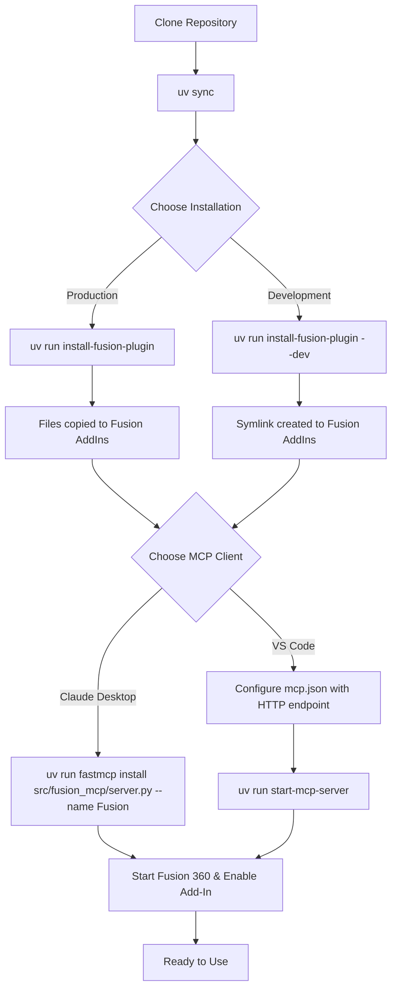

# Design Document: UV Modernization

## Overview

This design document describes the modernization of the Fusion MCP project to use uv as the package manager with proper pyproject.toml configuration. The modernization introduces CLI entry points for common operations, reorganizes the source code following Python packaging conventions, and enables standard MCP client integration using FastMCP's installation capabilities.

The goal is to replace the current manual Python scripts with a unified uv-based workflow that provides:
- Single-command project setup (`uv sync`)
- CLI commands for Fusion add-in installation (`uv run install-fusion-plugin`)
- CLI command for server startup (`uv run start-mcp-server`)
- Standard MCP client registration (`uv run fastmcp install`)

## Architecture

```
┌─────────────────────────────────────────────────────────────────┐
│                        Project Root                              │
├─────────────────────────────────────────────────────────────────┤
│  pyproject.toml          - Project config, deps, entry points   │
│  uv.lock                 - Locked dependency versions           │
│  README.md               - Updated documentation                │
│                                                                  │
│  ┌─────────────────────────────────────────────────────────┐   │
│  │  src/fusion_mcp/                                         │   │
│  │  ├── __init__.py      - Package init                     │   │
│  │  ├── server.py        - MCP server (moved from Server/)  │   │
│  │  ├── config.py        - Server configuration             │   │
│  │  ├── interceptor.py   - Response interceptor             │   │
│  │  └── cli.py           - CLI entry points                 │   │
│  └─────────────────────────────────────────────────────────┘   │
│                                                                  │
│  ┌─────────────────────────────────────────────────────────┐   │
│  │  FusionMCPBridge/     - Fusion 360 Add-In (unchanged)    │   │
│  │  ├── MCP.py           - Add-in main module               │   │
│  │  ├── MCP.manifest     - Fusion manifest                  │   │
│  │  ├── config.py        - Add-in configuration             │   │
│  │  ├── cam.py           - CAM functionality                │   │
│  │  └── ...              - Other add-in files               │   │
│  └─────────────────────────────────────────────────────────┘   │
└─────────────────────────────────────────────────────────────────┘
```

### Workflow Diagram



## Components and Interfaces

### 1. pyproject.toml Configuration

The central configuration file defining project metadata, dependencies, and CLI entry points.

```toml
[project]
name = "fusion-mcp"
version = "0.1.0"
description = "MCP integration for Autodesk Fusion 360"
requires-python = ">=3.10"
dependencies = [
    "fastmcp>=2.12.0",
    "uvicorn>=0.35.0",
    "requests>=2.32.0",
]

[project.scripts]
install-fusion-plugin = "fusion_mcp.cli:install_plugin"
start-mcp-server = "fusion_mcp.cli:start_server"

[build-system]
requires = ["hatchling"]
build-backend = "hatchling.build"

[tool.hatch.build.targets.wheel]
packages = ["src/fusion_mcp"]
```

### 2. CLI Module (src/fusion_mcp/cli.py)

Provides entry point functions for CLI commands.

#### Interface: install_plugin()

```python
def install_plugin() -> None:
    """
    Install the Fusion 360 MCP add-in.
    
    CLI Arguments:
        --dev: Create symlink instead of copying (for development)
    
    Behavior:
        - Determines target path based on platform (macOS/Windows)
        - In normal mode: copies FusionMCPBridge to target
        - In dev mode: creates symlink to FusionMCPBridge
        - Creates target directory if it doesn't exist
        - Handles existing symlinks/directories appropriately
    
    Exit Codes:
        0: Success
        1: Error (directory exists in dev mode, copy failed, etc.)
    """
```

#### Interface: start_server()

```python
def start_server() -> None:
    """
    Start the MCP server with SSE transport.
    
    Behavior:
        - Imports and runs the FastMCP server
        - Listens on http://127.0.0.1:8000/sse
        - Blocks until interrupted (Ctrl+C)
    """
```

### 3. Server Module (src/fusion_mcp/server.py)

The existing MCP server code relocated from `Server/MCP_Server.py` with minimal modifications to work as a module.

#### Interface: mcp (FastMCP instance)

```python
mcp = FastMCP("Fusion", instructions="...")
```

The FastMCP instance with all tool definitions. Can be imported and run programmatically or via CLI.

### 4. Path Resolution

Platform-specific path resolution for Fusion 360 add-ins directory.

```python
def get_fusion_addins_path() -> Path:
    """
    Get the Fusion 360 add-ins directory path for the current platform.
    
    Returns:
        Path: Platform-specific path to Fusion add-ins directory
        - macOS: ~/Library/Application Support/Autodesk/Autodesk Fusion 360/API/AddIns
        - Windows: %APPDATA%/Autodesk/Autodesk Fusion 360/API/AddIns
    
    Raises:
        RuntimeError: If platform is not supported (not macOS or Windows)
    """
```

## Data Models

### Installation Result

```python
@dataclass
class InstallResult:
    success: bool
    message: str
    path: Path
    is_symlink: bool
```

## Correctness Properties

*A property is a characteristic or behavior that should hold true across all valid executions of a system-essentially, a formal statement about what the system should do. Properties serve as the bridge between human-readable specifications and machine-verifiable correctness guarantees.*

Based on the prework analysis, the following correctness properties have been identified:

### Property 1: pyproject.toml Schema Validation

*For any* valid pyproject.toml file in this project, parsing the file SHALL yield a configuration containing: project name, version, description, Python version requirement (>=3.10), all required dependencies (fastmcp, uvicorn, requests), CLI entry points (install-fusion-plugin, start-mcp-server), and a valid build system configuration.

**Validates: Requirements 2.1, 2.2, 2.3, 2.4**

### Property 2: Platform-Specific Path Resolution

*For any* supported platform (macOS or Windows), the path resolution function SHALL return the correct Fusion 360 add-ins directory path for that platform without raising exceptions.

**Validates: Requirements 3.2, 3.3**

### Property 3: Copy Installation with Directory Creation

*For any* valid source directory and target path (including non-existent parent directories), the copy installation function SHALL create all necessary parent directories and copy all files from source to target, resulting in identical directory contents.

**Validates: Requirements 3.1, 3.5**

### Property 4: Symlink Installation Creates Symlink

*For any* valid source directory and non-existent target path, the symlink installation function SHALL create a symbolic link at the target pointing to the source, and the result SHALL be identified as a symlink by the filesystem.

**Validates: Requirements 4.1**

### Property 5: Symlink Installation Replaces Existing Symlink

*For any* target path that is an existing symbolic link, the symlink installation function SHALL remove the existing symlink and create a new one pointing to the source directory.

**Validates: Requirements 4.2**

### Property 6: Symlink Installation Warns on Existing Directory

*For any* target path that is an existing regular directory (not a symlink), the symlink installation function SHALL return an error result without modifying the directory, and the directory contents SHALL remain unchanged.

**Validates: Requirements 4.3**

### Property 7: README Documentation Completeness

*For any* valid README.md file in this project, the content SHALL contain documentation for: `uv sync` setup command, `uv run install-fusion-plugin` with `--dev` option, `uv run fastmcp install` command, and `uv run start-mcp-server` command, while NOT containing references to deprecated scripts (Install_Addin.py, pip install).

**Validates: Requirements 8.1, 8.2, 8.3, 8.4, 8.5**

## Error Handling

### Installation Errors

| Error Condition | Handling |
|----------------|----------|
| Source directory not found | Exit with error message indicating FusionMCPBridge not found |
| Target directory exists (dev mode) | Exit with warning, do not modify existing directory |
| Permission denied | Exit with error message suggesting running with elevated privileges |
| Unsupported platform | Exit with error message listing supported platforms |
| Symlink creation fails (Windows) | Suggest running as administrator or enabling developer mode |

### Server Errors

| Error Condition | Handling |
|----------------|----------|
| Port 8000 already in use | Exit with error message suggesting alternative port or killing existing process |
| Fusion 360 not responding | Log warning, continue running (Fusion may start later) |
| Invalid tool parameters | Return error response to MCP client with details |

## Testing Strategy

### Dual Testing Approach

This project uses both unit tests and property-based tests:

- **Unit tests**: Verify specific examples, edge cases, and integration points
- **Property-based tests**: Verify universal properties that should hold across all inputs

### Property-Based Testing Framework

The project will use **Hypothesis** for property-based testing in Python. Each property test will run a minimum of 100 iterations.

### Test Structure

```
tests/
├── __init__.py
├── test_cli.py           # Unit tests for CLI functions
├── test_path_resolution.py  # Property tests for path resolution
├── test_installation.py  # Property tests for installation logic
└── conftest.py           # Shared fixtures
```

### Property Test Annotations

Each property-based test MUST be tagged with a comment referencing the correctness property:

```python
# **Feature: uv-modernization, Property 2: Platform-Specific Path Resolution**
@given(platform=st.sampled_from(["darwin", "win32"]))
def test_path_resolution_returns_valid_path(platform):
    ...
```

### Test Coverage

| Component | Unit Tests | Property Tests |
|-----------|------------|----------------|
| pyproject.toml validation | Schema parsing | Property 1 |
| Path resolution | Platform detection | Property 2 |
| Copy installation | File operations | Property 3 |
| Symlink installation | Link creation | Properties 4, 5, 6 |
| README validation | Content parsing | Property 7 |
| Server startup | Integration test | - |
